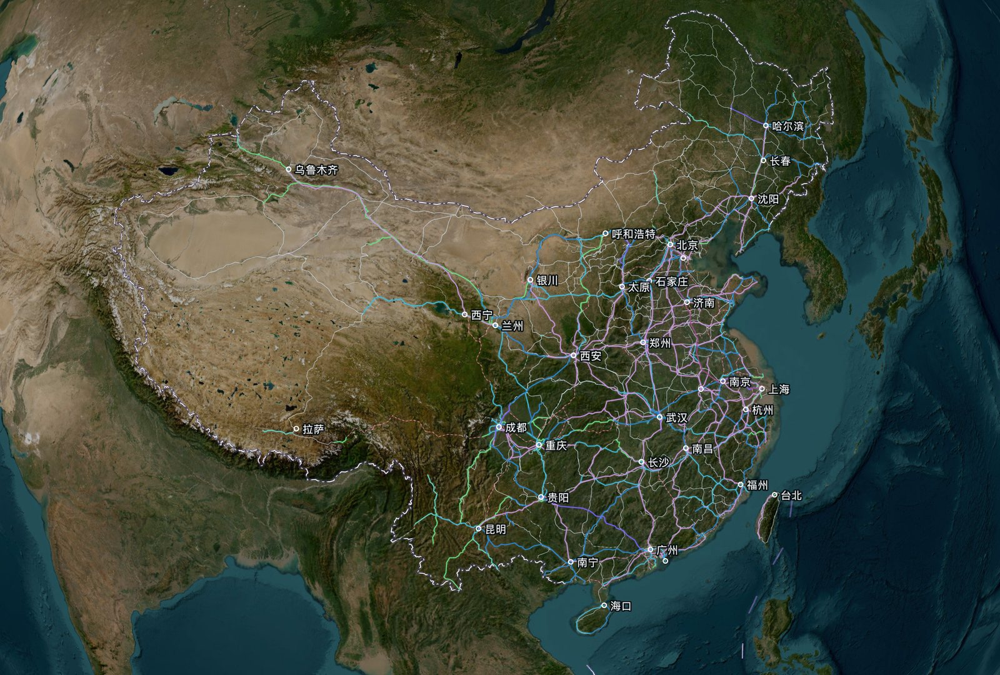
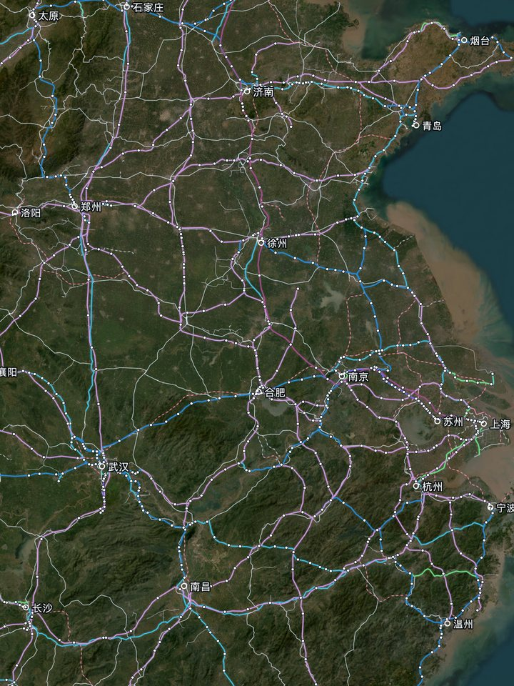
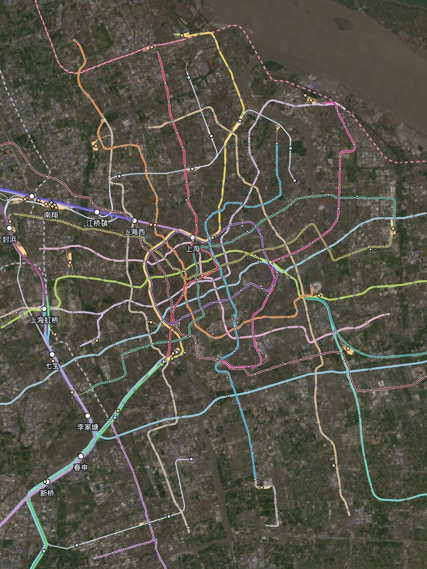
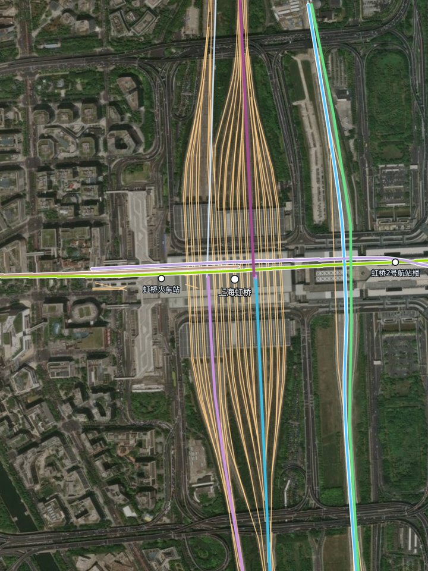
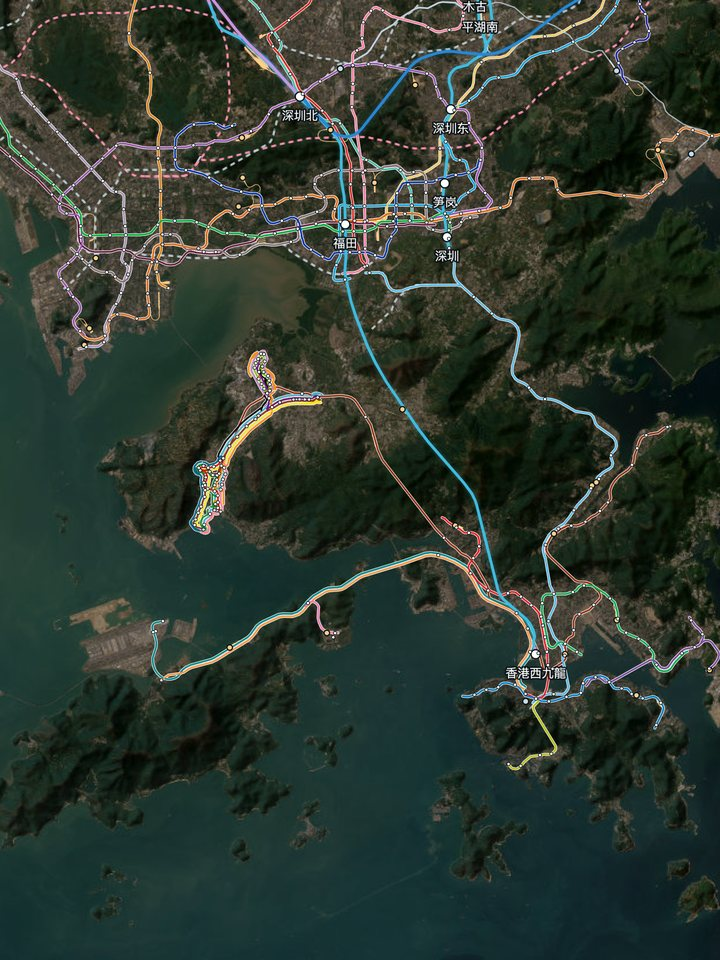
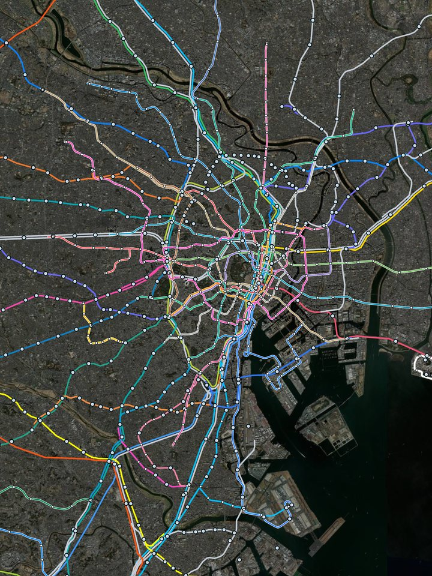

# Rail Globe

中国的铁路网和全国各城市的地铁，叠加在卫星影像的地球上。

`main` 分支是线上版本，含中国和日本。含英国铁路（按运营公司上色）的版本在 `with-uk` 分支，没有发布成网页。两者的差别只有 `site.json` 里的开关和据此生成的数据。

在线查看：https://rail-globe.github.io/




|  |  |  |
|:-:|:-:|:-:|
| 动车组线路按设计时速分七档上色 | 上海的地铁，按各线官方色 | 上海虹桥站：放大能看到每一股道 |
|  |  |  |
| 香港和深圳：港铁、轻铁和深圳地铁 | 日本：有线路色的线路按线路色 | 东京：每条线是它自己的线路色 |

截图里的卫星影像来自 Esri World Imagery，线路数据来自 OpenStreetMap 贡献者，许可见下面的“数据与许可”。

## 图上有什么

- 中国：铁路按区段设计时速分 >350、350、300、250、200、160、<160 七档，没有设计时速资料的线路列为普速铁路，未建成线路用虚线
- 日本：全国铁路和各城市地铁。线路有自己的线路色就用线路色，没有的用同一种中性灰，不按公司上色；新干线也一样，资料里没有定线路色的九州、西九州、北海道新干线画成中性灰。日本不按速度或线路等级上色，寻路暂不含日本。同一走廊里并行的线路按实际位置并排画，放大后回到各自的轨道上。卡片顶部可以在中国和日本之间切换
- 英国（仅 `with-uk` 分支）：全国铁路，按主要客运运营公司上色，也可以切换为按线路等级
- 地铁：全国各城市的地铁、轻轨、单轨和磁浮（含港铁、澳门轻轨、台湾的捷运），按线路官方色
- 城际和市郊按运营方归类：地铁公司运营的城际、市域线归入“地铁 / 市郊”；铁路局运营、借国铁线路跑的市郊列车单列一行，作为细线叠在国铁线路旁，国铁线路本身的归属不变
- 站场与车辆基地、车站、国界
- 地球和平面两种视图；线路页分铁路和地铁两类，地铁按城市列出，点线路即可在图上高亮；顶部可快速跳到主要城市
- 两站之间怎么走（仅中国）：点两个车站或输入站名，给出沿真实线路的走法、里程和估算时间。铁路和地铁一起算，相邻的火车站和地铁站之间按步行换乘。不是车次和时刻表

长线路按有来源和明确范围的区段分别着色，整条线路保留一个身份，选择时所有区段一起高亮。优先采用线下设计标准，缺失时采用轨道设计标准。设计标准与参考运行速度分别展示，不能用站内限速推断设计等级。网站给出的 165、205 分别归入 160、200 档，同时保留具体数值。已进入联调联试的线路按已建成画实线。虚线只表示未建成线路，包括线路还没修到、但站内已提前铺好的那一小段轨道。

每条线路只画一条线：复线只画其中一股轨道，上下行分开走不同线位的区段才各画一条（`scripts/single_track.py`）。所以线旁的平行线只表示另一条线路或另一种列车共用这段轨道。地铁也一样：几条线路共用的轨道上，每条线路并排各画一条（港铁东涌线与机场快线、屯门和元朗的轻铁、上海 3 号线与 4 号线）；颜色相同的贯通线路只画一条。并排只发生在共线区段，线路独自运行时画在自己的轨道上，进出共线区段时逐步移到一侧（`scripts/side_by_side.py`）。寻路和车站匹配仍然用全部轨道。

轻铁、轻轨按街道的尺度画：只有在同一条轨道上才算并线，其余地方画在自己的轨道上，道岔处的弯道沿真实轨道走，每条线画到自己的终点站（`scripts/along.py`）。`process_osm.py` 每次都会量一遍画出来的线离自己的轨道有多远、有没有轨道没画到，结果在 `output/metro_fit.json`。

两条不同等级的线路共用同一段轨道时，轨道保持所属线路的颜色，另一条线路在旁边画成一条平行线（如汉十高铁在汉口至云梦东之间走武孝城际的轨道）。这类区段列在 `scripts/process_osm.py` 的 `SHARED_KNOWN` 里。

## 数据与许可

- 线路、车站、站场：© [OpenStreetMap](https://www.openstreetmap.org/copyright) 贡献者，ODbL。Geofabrik 快照截止 2026-10-05 20:21:35 UTC（日本为 2026-10-06 20:21:06 UTC）。
- 设计时速参考：[中国动车组线路资料](https://www.china-emu.cn/RailRoads/)。保存线路和区段的事实字段、来源链接及读取日期，不复制网站的地图、图片或文章。该网站为参考资料，范围不清或存在疑点的记录保留待核实。
- 卫星影像：Esri World Imagery（Esri, Maxar, Earthstar Geographics），在线加载，不包含在本仓库中。
- 标注字形：Open Sans，SIL Open Font License。
- 地图引擎：[MapLibre GL JS](https://maplibre.org/)。

顶部的营业里程数字来自交通运输部《2025年交通运输行业发展统计公报》，不是从地图数据计算的。

OSM 快照日期不代表每一条线路都已跟上现实进度。已核实的区段状态记录在 `data/rail_status_overrides.json`，保留来源、核查日期和区段范围，原始 OSM 标签不覆盖。已建成也不等于已经开通载客。

## 本地运行

```bash
python3 scripts/serve.py
```

然后打开 http://localhost:8765 。页面源码在 `src/app.html`，修改后运行 `python3 scripts/build.py` 重新生成 `index.html`。

## 重新生成数据

需要 Python 3、`osmium`、`shapely` 和 `numpy`，以及 Geofabrik 的 `china`、`taiwan` 两份 `.osm.pbf` 文件（含英国的版本还需要 `united-kingdom`），放在 `data/raw/` 下。`site.json` 里的 `uk` 决定是否包含英国。

```bash
python3 scripts/build_border.py       # 国界，同时缓存省界（process_osm.py 用它划分地铁所属地区）
python3 scripts/extract_osm.py        # 中国、港澳台
python3 scripts/extract_osm.py uk     # 英国（仅 with-uk 分支需要）
python3 scripts/extract_osm.py jp     # 日本（japan-latest.osm.pbf）
python3 scripts/process_jp.py         # 日本的图层 data/jp_*.json，独立于中国的处理
python3 scripts/fetch_design_catalog.py # 显式刷新设计时速参考资料（需要 requests、beautifulsoup4）
python3 scripts/extract_design_points.py # 区段边界使用同一快照的车站、线路所坐标
python3 scripts/process_osm.py        # 连续线路几何，再按设计区段着色
python3 scripts/build_graph.py        # 两站寻路用的线路网络
python3 scripts/build.py              # 生成页面
python3 scripts/check_layers.py       # 全国核查：重复、断开、急转弯、互相遮挡、偏离轨道
python3 scripts/audit_rail_data.py    # 原始名称、建设状态、已核实区段和待核查项
python3 -m unittest discover -s tests # 画法的回归测试
```

有来源说明是既有线、只是被高铁列车借用的区段，在 `data/rail_design_overrides.json` 里标为 `conventional`，画成普速并保留来源。参考目录随数据保存在仓库，离线重算不依赖实时网站响应。

同样的数据和代码每次生成的结果相同（`process_osm.py` 固定了哈希种子）。
